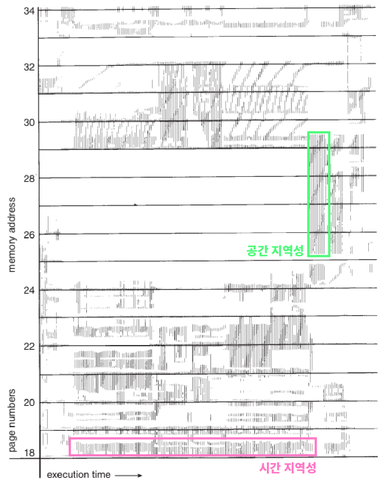

### 10. 캐시의 지역성

캐시 메모리 - 속도가 빠른 장치, 느린 장치간의 속도차를 방지하기 위한 범용 메모리
자주 사용하는 프로그램, 데이터를 저장하여 바로 사용할 수 있게하여 빠른 속도를 달성하게 해줌

매핑 - 캐시와 주기억장치 사이에서 데이터를 옮기는 행위

- 직접 매핑
    - 주기억장치의 블록들이 지정된 한 개의 캐시 라인으로만 매핑이 가능
    - 메모리가 1부터 100, 캐시가 1부터 10까지 있다고 가정했을 때
      메모리의 1에서 10까지는 1에, 11부터 20까지는 2에 저장하는 방식
    - 간단하고 구현하는 비용이 적다
    - 하지만 적중률이 낮고 좋지 않은 성능을 보여주는 단순한 방식
      예를 들어 30부터 40까지 필요한 경우 다시 캐시를 불러오는 과정인 필요
- 연관 매핑
    - 속도보다는 적중률을 높여 캐시의 공간 효율을 높이는 방식
    - 순서를 일치시키지 않고 캐시의 아무 공간에는 자유롭게 배치, 필수적인 캐시들 위주로 들어가기 때문에 적중률이 높지만 찾는 과정은 복잡하여 속도가 느림
- 집합 연관 매핑
    - 위의 두 가지 매핑 방식을 섞은 형태
    - 순서를 일치시키고 자유롭게 배치할 수 있지만 일정한 그룹을 두고 저장
    - 직접 매핑과 동일한 조건의 메모리, 캐시 크기가 있을 때 1부터 5까지는 1부터 50까지의 메모리 데이터를 자유롭게 배치
    - 블록화가 이루어지므로 검색 과정이 효율적이며 그룹화로 저장위치에 대한 효율을 상승시키는 방식

**캐시의 지역성 - 적중률 극대화**

- 데이터에 대한 접근이 시간적-공간적으로 가깝게 발생하는 것  
  → 어느 한 순간 한 부분을 집중적으로 참조하는 특성
- 시간적 지역성
  → 최근 참조된 주소는 짧은 시간 내 다시 참조되는 특성
  자주 읽기 쓰기가 반복되는 주소는 상대적으로 작은 크기의 캐시를 사용해도 효율성이 높다
- 공간적 지역성
  → 특정 데이터와 가까운 주소를 순서대로 접근한 경우, 메모리 주소에 접근할 때 주소가 속한 블록을 전부 캐시에 가져오게 됨
  인접한 주소의 데이터는 참조될 가능성이 높기 때문에 메모리 주소를 오름차, 내림차순으로 접근하면 효율성을 높일 수 있다.

출처: [https://wookcode.tistory.com/183](https://wookcode.tistory.com/183)