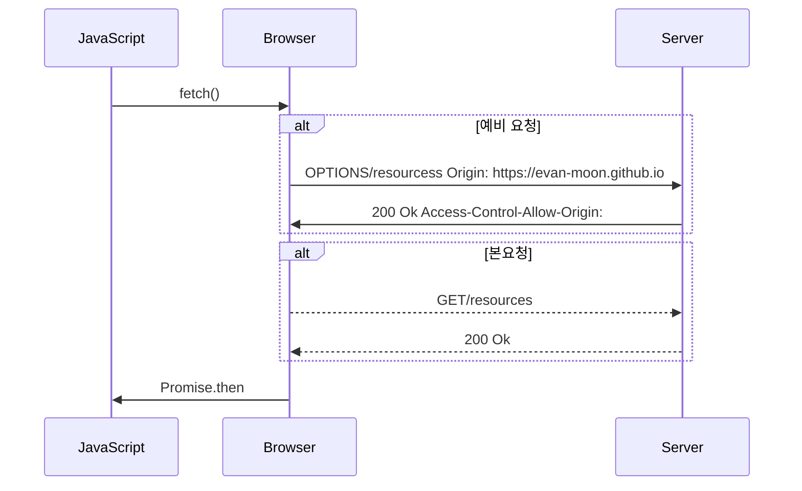

# 네트워크 - CORS
## 개요
> 프론트엔드 개발자랑 서버개발자가 프로젝트를 진행하다보면 한번쯤 만나보는 이슈인 CORS, SOP
개념만 알고 있다면 빠르게 해결할 수 있는 내용이므로 정리

## SOP(Same-origin policy, 동일 출처 정책)
자바스크립트 엔진 표준 스펙의 보안 규칙으로 하나의 출처(Origin)에서 로드된 자원(문서나 스크립트)이 호스트나 프로토콜, 포트번호가 일치하지 않는 자원과 상호작용 하지 못하도록 요청 발생을 제한하고, 동일 출처(Same Origin)에서만 접근이 가능한 정책
- 다른출처공격(CSRF)를 예방

## CORS ?
> Cross Origin Resource Sharing 의 약자, 교차 출처 리소스 공유

Cross Origin = 웹 내에서 현재 자신의 Resource(도메인, 프로토콜, 포트)가 다른 상황을 의미
Cross Origin Request = Cross Origin 상황에서 다른 출처에 있는 자원을 가져오기 위해 하는 요청

- URL은 도메인만 뜻하는게 아니고 프로토콜과 포트까지 포함하는 개념
- 출처를 구성하는 세 요소
    - 프로토콜
    - 도메인(호스트이름)
    - 포트
- 세 요소중 하나라도 다르면 CORS 에러를 만나게됨

-출처: https://docs.tosspayments.com/resources/glossary/cors

따라서 CORS를 설정 한다는 건 `출처가 다른 서버간의 리소스 공유`를 허용한다라는 뜻

정리
- SOP: 서로다른 출처일 때 리소스 요청과 응답을 차단하는 정책
- CORS: 서로 다른 출처라도 리소스요청, 응답을 허용할 수 있도록 하는 정책

| URL                             | 접근이 가능한가? (SOP를 준수했는가?) |
| ------------------------------- | ----------------------- |
| https://www.myshop.com/example/ | ✅ 프로토콜, 도메인, 포트가 같음     |
| https://myshop.com/example2/    | ✅ 프로토콜, 도메인, 포트가 같음     |
| http://myshop.com/example       | ❌ 프로토콜과 포트가 다름          |
| http://en.myshop.com/example/   | ❌ 도메인이 다름               |
| http://www.myshop.com/example/  | ❌ 프로토콜이 다름              |
| http://myshop.com:8000/example/ | ❌ 포트가 다름                |
## CORS 시나리오
Prefilght Request
> Simple Request와는 다르게, 지금 보내는 요청이 유효한지를 확인하기 위해 `OPTIONS` 메서드로 예비 요청을 보내는 것

왜 쓸까?
- 만약 크기가 수십만인 Array를 body에 담아서 요청을 보냈는데 CORS 위반하는 거라면? 리소스 낭비와 서버에 부하를 주게 됨

## CORS 에러 대응하기
### 서버에서 Access-Control-Allow-Origin 응답 헤더 세팅
서버에서 `Access-Control-Allow-Origin` 헤더를 설정해서 요청을 수락할 출처를 명시적으로 지정할 수 있음
이 헤더를 세팅하면 출처가 다르더라도 `https://myshop.com`의 리소스 요청을 허용하게 됨

주의사항
- `*`를 설정하면 출처에 상관없이 리소스에 접근할 수 있는 와일드카드이기 때문에 보안에 취약해짐. 그래서 `'Access-Control-Allow-Origin': https://myshop.com`과 같이 직접 허용할 출처를 세팅하는 방법이 더 좋음

### 프록시 서버 사용하기
웹 애플리케이션이 리소스를 직접적으로 요청하는 대신, `프록시 서버`를 사용하여 웹 애플리케이션에서 리소스로의 요청을 전달하는 방법 이 방법을 사용하면, 웹 애플리케이션이 리소스와 동일한 출처에서 요청을 보내는 것처럼 보이므로 CORS 에러를 방지할 수 있음

- `http://example.com`라는 주소의 웹 애플리케이션이 `http://api.example.com`라는 리소스에서 데이터를 요청하는 상황을 가정
- 웹 애플리케이션은 직접적으로 리소스에 요청하는 대신, `http://example-proxy.com`라는 프록시 서버에 요청을 보낼 수 있음 그러면 프록시 서버가 `http://api.example.com`으로 요청을 전달하고, 응답을 다시 웹 애플리케이션에 반환
- 이렇게 하면 요청이 `http://example-proxy.com`보내진 것처럼 보이므로, CORS 에러를 피할 수 있습니다.

출처: https://docs.tosspayments.com/resources/glossary/cors