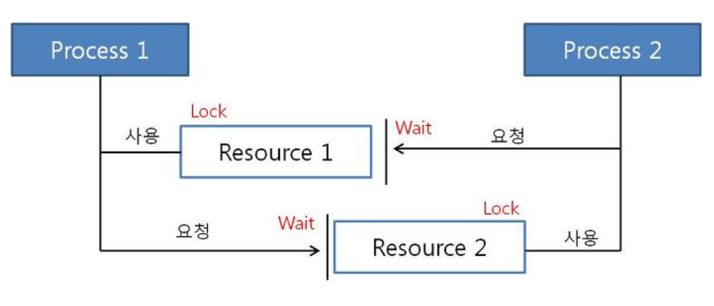

### **교착상태(Deadlock)의 개념과 조건**

---

**프로세스가 서로 가진 자원을 기다리며 무한 대기하는 상태**

- 상호 배제
    - 자원은 한번에 하나의 프로세스만 사용 가능
- 점유 대기
    - 프로세스가 하나의 자원을 이미 점유하고 있으며
    - 다른 자원을 추가로 사용하기 위해 대기 중이어야 함
- 비선점
    - 다른 프로세스가 사용 중인 자원을 강제로 빼앗을 수 없음
- 순환 대기
    - 자원을 기다리는 프로세스 간에 사이클이 형성
    - p1은 p2의 자원을 기다리고, p2는 p3의 자원을 기다리고, pn은 다시 p1의 자원을 기다리는 상태

**해결방법**

1. 데드락 상태의 예방 - 자원의 낭비와 부작용이 존재
    - 상호 배제 조건 방지
        - 데드락을 예방할 수 있으나 동기화에 문제가 발생 가능
    - 점유 대기 방지
        - 프로세스는 처음부터 필요한 리소스를 전부 요구, 모든 리소스를 한번에 제공 받을 때까지 대기하기
    - 비선점 방지
        - 다른 프로세스에 할당된 자원의 선점권이 없다고 가정
        - 높은 우선순위의 프로세스가 해당 자원을 선점할 수 있도록 설계
    - 순환 대기 방지
        - 순환 형태를 이루지 못하도록 한 쪽 방향으로만 자원을 요구할 수 있도록 함
2. 회피
    - 리소스 할당 측면에서 교착상태가 발생할 수 있는 자원할당을 하지 않는 방법
    - 은행원 알고리즘 (다익스트라 알고리즘)
        - 안정상태: 교착 상태가 발생하지 않으며 모든 프로세스를 완료할 수 있는 상태
        - 불안전 상태: 교착 상태가 발생할 수 있는 상태
        - 현재 할당된 리소스와 제공할 수 있는 리소스를 계산, 안정 상태를 유지할 수 있는 요구만 수락하면서 프로세스를 진행
        - 항상 안정상태를 유지해야하기 때문에 자원의 활용도가 낮아지는 단점이 존재
3. 탐지 후 회복
    - 데드락이 발생했는지를 탐지
        - 프로세스를 1개 이상 또는 전부 중단
        - 교착 상태에 빠진 프로세스가 필요로하는 자원을 강제로 빼앗아오고 해당 프로세스는 강제 종료 및 재시작