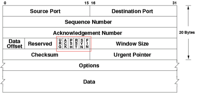

### **2. TCP 3-way-handshake**

---

### **TCP/IP**

컴퓨터와 다른 컴퓨터가 데이터 통신을 하기 위한 규약(프로토콜)으로 OSI 7계층 중 3, 4계층을 다루는 프로토콜

IP는 패킷 전달 여부와 보내는 순서, 받는 순서가 다를 수 있다.
TCP는 IP 위에서 작동하며 패킷의 추적 및 관리 역할을 맡아 데이터의 전달과 순서를 보증해준다.
→ IP 주소를 사용하여 클라이언트, 서버 간의 데이터를 주고 받고 잘 수신했는지 확인

> **OSI 4계층(Transport layer)**
수신자와 송신자 사이의 연결을 담당하는 부분, 신뢰성 있는 연결 유지 역할을 맡음
ex) TCP, UDP

**OSI 3계층(Networkd layer)**
IP를 활용하여 가고자하는 목적지와 경로를 찾아주는 역할(라우팅)

### **handshake**

장치들 사이에서 TCP/IP 프로토콜을 사용하는 프로그램이 데이터를 주고 받기 전에 상대방 컴퓨터와 세션을 수립하는 과정

- **3-way handshake - 연결**

[https://www.geeksforgeeks.org/tcp-3-way-handshake-process/](https://www.geeksforgeeks.org/tcp-3-way-handshake-process/)

1. 클라이언트는 접속을 요청하는 SYN을 서버에 전송
2. 서버는 클라이언트의 SYN을 받고 요청 수락이 담긴 SYN, ACK를 패킷에 담아 클라이언트에 전송
3. 클라이언트는 서버의 응답 수락을 확인하고 ACK를 서버로 보내면 연결이 성립된다.
    - ***SYN*** - synchronize sequence numbers

연결을 요청할 때 사용하는 랜덤한 값, ***X***

외부 공격에 대비해 랜덤한 값으로 이루어진 TCP 헤더에 담아 서버로 전송

- ***SYN/ACK***

SYN을 받은 서버는 새롭게 생성한 시퀀스 넘버를 SYN에 담고 ***Y***
ACK 패킷에는 받은 SYN 값에 +1을 하여 전송한다. ***X + 1***

- ***ACK*** - acknowledgement

다시 클라이언트는 서버에서 전송받은 SYN에 +1을 더해 ***Y+1***
ACK에 담아 서버에 전송하고 연결을 성립한다.

- **4-way handshake - 연결 해제**

***FIN*** - TCP 연결을 종료할 때 사용하는 패킷

[https://hojunking.tistory.com/107](https://hojunking.tistory.com/107)

커넥션 종료는 서버와 클라이언트 누구나 시작할 수 있다.

1. 클라이언트나 서버 측에서 FIN 세그먼트를 전송해 연결 종료를 요청
2. 요청을 받은 측에서는 ACK를 보내고 남아있는 데이터가 있을 수 있으므로 이를 마저 전송
3. 요청을 받은 측에서 전송할 데이터가 없거나 전송을 마쳤다면 FIN을 전송한다.
4. 연결 종료를 요청한 측에서 ACK를 보내고 연결이 종료된다.

<aside>
💡 **TCP FLAG**

TCP 헤더가 가지고 있는 하나 당 1비트로 구성된 플래그 6개

활성화된 경우 비트를 1로 바꾸어 전송한다.

</aside>

---

### 질문 예상

1. 서버와 접속할 때 일련의 과정을 설명해주세요.
2. 3 way-handshake와 4 way-handshake에 대해 설명해주세요.
3. OSI 7계층에 대해 어느 정도 알고 있나요.-