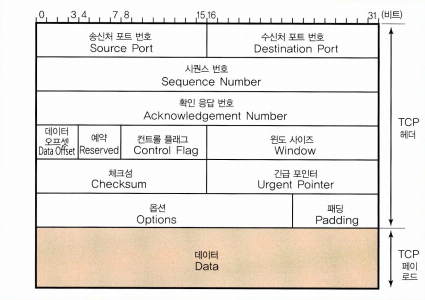

### **TCP와 UDP의 헤더 분석**

---

TCP, UDP: OSI 4계층에 속하는 네트워크에서 사용하는 데이터 전송 프로토콜

**TCP**

- 연결형 서비스 지원
- 신뢰성, 안정성을 보장하지만 UDP에 비해 느린 속도
- 대규모 데이터 통신에 적합

**TCP 헤더 구성**

[https://go-ahead.tistory.com/7](https://go-ahead.tistory.com/7)

- 출발지, 도착지 포트 (각 16비트)
- 시퀀스 넘버 (32비트)
    - 데이터의 모든 바이트에 붙는 고유한 일련번호
    - 네트워크 불안정으로 일부 패킷이 손실되거나 지연되는 경우 시퀀스 넘버를 통해 올바른 세그먼트 순서대로 재배열이 가능
- 응답 넘버 (32비트)
- 데이터 오프셋 (4 비트)
    - 데이터의 시작 위치를 표시
    - 이 필드 값에 4를 곱하면 헤더를 제외한 실제 데이터의 시작위치를 알 수 있다.
- 예약 (4 비트)
    - 확장을 위해 마련해둔 필드, 0으로 작성
- 플래그 (8 비트)
    - CWR, ECE, URG, ACK, PSH, SYN, FIN
- 윈도우 사이즈
    - 수신 가능한 데이터 크기를 명시
- 체크섬
    - 데이터 송신 중 발생하는 오류 검출위한 값
- Urgent Pointer
    - 긴급 포인터로 이 포인터가 가리키고 있는 데이터를 우선적으로 처리
- Options
    - TCP의 기능 확장에 사용하는 필드, 고정되지 않았으며 가변적

---

**UDP**

TCP에 비해 단순한 구조를 가지고 있다.

- 송신 포트
- 수신 포트
- 패킷 길이
- 체크섬