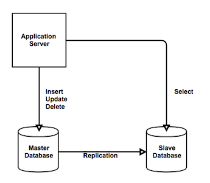

### **Replication**

---

**두 개 이상의 DB를 수직적으로 구성, DB의 부하를 분산시키는 기술**

[https://nesoy.github.io/articles/2018-02/Database-Replication](https://nesoy.github.io/articles/2018-02/Database-Replication)

**Master DB와 Slave DB - 현재는 Slave를 인종차별 이유로 Replica라고 부름**

- Master DB는 Insert, Update, Delete 쿼리를 수행
- Master DB를 복제한 Slave DB는 Select 쿼리를 수행
- 대부분의 쿼리로 인한 부담은 Select로 인해 발생하는 것을 고려하여 이를 분산 시킴으로써 병목 현상을 방지하는 것

**특징**

- 스케일 아웃
    - 여러 개의 복제복을 통해 쿼리를 통한 부하를 분산시키고
    - 읽기 쿼리를 여러 DB에서 진행할 수 있으므로 속도를 증가시킬 수 있다.
- 데이터 보호
    - 원본 데이터는 Master에서 관리하지만 Master가 손상되어도 다른 Slave를 Master로 활용할 수 있으므로 백업이 간편하다.
- 데이터 정합성 보장할 수 없음
    - Replica는 어디까지나 Master의 복사본
    - Slave가 Master의 정보를 제때 복사하지 못하거나 처리 속도가 느릴 경우 데이터의 정합성을 해칠 수 있다.
- Binary Log
    - MySQL에서 복제에 사용하는 로그 파일
    - 서버에서 CREATE, ALTER, DROP이 수행되면 해당 이벤트를 기록
    - 이 로그를 통해 Slave DB들이 변경사항을 적용하게 된다.
    - Master에서는 Slave의 바이너리 로그까지 관리해주지 않는다. 불필요한 로그들이 쌓일 수 있다.

**MySQL에서의 Replication 과정**

1. 클라이언트는 쓰기, 삭제 등의 쿼리를 요청
2. Master에서 변경사항을 바이너리 로그에 기록, 이후 DB에 commit
3. Master는 새로운 이벤트 로그를 읽어 Slave DB에 전송
    1. 이때 사용되는 스레드의 이름은 Master Thread
    2. 이때 비동기, 동기 선택은 성능 또는 데이터 정합성 중 우선순위를 두고 결정
4. Slave는 Master에게서 받은 이벤트 로그를 Relay log에 기록
    1. I/O Thread가 사용된다. ([쓰레드 관련 더 읽어보기](http://cloudrain21.com/mysql-replication))
5. Slave는 변경사항을 DB에 저장

   
   [http://cloudrain21.com/mysql-replication](http://cloudrain21.com/mysql-replication)