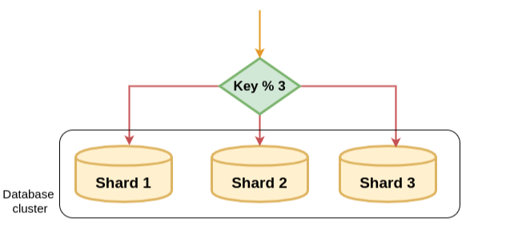

### **샤딩**

---

**데이터를 조각내 분산 저장하는 데이터 처리 기법**

수평적 파티셔닝의 일종이지만

→ **같은 DB 서버 내**에서 테이블 분할

→ **DB 서버 자체를 분할**한다는 것에서 차이가 존재

**파티셔닝**

→ DB를 특정 조건을 적용해 여러 조건으로 분할

→ 파티션 별로 연산을 통해 I/O 분산이 가능

→ 파티션 별로 백업과 복구가 가능하여 전체 데이터 손실을 방지

→ 테이블이 여러개로 나누어지면서 수가 증가할수록 JOIN으로 인한 비용 증가

→ 테이블과 인덱스 별도 파티셔닝 불가능

**샤딩**

- 확장성, 데이터 처리 속도 증가
    - 일부 샤드에서 백업, 복구 등의 작업이 이루어져도 다른 샤드에 영향 없음
    - 데이터 분산으로 병렬 처리가 가능해지면서 DB 응답 시간 단축
    - 스캔할 범위가 줄어들기 때문에 쿼리 속도 증가
- 탈중앙화, 보안성 증가
    - 각 샤드는 독립적으로 운영, 처리량과 성능을 향상시킴
    - 중앙에서 모든 정보를 처리하지 않음, 외부 침입으로 인한 피해 감소
- 데이터 처리 복잡성이 증가
    - 여러 샤드에 분산되어 있는 데이터를 서로 참조하는 과정이 필요
      한 샤드가 망가졌는데 백업을 못했다?
      → 데이터 무결성이 깨질 수 있음
    - 데이터가 한쪽의 샤드에만 몰릴 경우 (핫스팟) 샤딩이 무의미해짐
    - 샤딩을 실행하면 원래 상태로의 복구가 어려움, 신중한 적용이 필요

**종류**

- **모듈러 샤딩**
    - 레인지 샤딩에 비해 데이터가 균일하게 분산
    - DB를 추가로 증설하는 경우 전체적인 재정렬이 필요하다.
    - 일정한 데이터 성격을 유지할 것으로 보이는 곳에 사용하는 것이 적절

PK를 연산한 결과를 사용해 DB 별로 라우팅

→ 아래의 그림 예시처럼 PK를 DB의 갯수로 나누어 분산

- **레인지 샤딩**
    - PK의 범위를 기준으로 데이터를 샤딩하는 방식
    - 모듈러와 다르게 증설로 인한 재정렬 비용이 들지 않는다.
    - 일부 DB에 데이터가 몰릴 수 있다.
      쇼핑몰 DB가 있다고 가정했을 때 일부 시기에 가입한 유저들이 특정 범위의 PK를 가지고 있으며 해당 유저들이 다른 사용자에 비해 매우 활발하게 활동
      → 특정 샤드에 부하가 쏠리면서 불균형이 발생, 샤딩의 의미가 희석됨

- **디렉토리 샤딩**
    - 별도의 조회 테이블을 통해 샤딩을 하는 방식
    - 사전에 조회 테이블에 DB 정보를 저장하고 이와 매칭되는 샤드를 구성
    - 쿼리를 하고자 할 때 먼저 조회 테이블을 보고 매칭되는 샤드에서 작업을 진행하는 방식
    - 자주 쓰이는 방법은 아니다.

- **해시 샤딩**
    - 키를 해시한 결과를 이용하여 샤딩을 진행 - 가장 많이 사용
    - 해시 결과값을 기준으로 샤딩이 진행되기 때문에 데이터가 랜덤하고 고르게 분산된다.
    - 정보의 의미에 따라 분산되거나 하는 기준이 없기 때문에 물리적 샤드 추가 시 해시 값 재할당이 필요해 어려움이 존재한다.

### DB 클러스터링

---

**여러 대의 DB 서버를 수평적으로 관리하여 효과적인 Failover System을 구축하는 방식**

- 노드 간에 동기화를 통해 일관성있는 데이터 획득이 가능
- 로드 밸런싱으로 적절한 트래픽 관리 가능
- 문제가 생겨도 바로 다른 DB 서버를 사용이 가능
- Replication과 비교했을 때 전 노드가 동기화된 상태로 있어야하기 때문에 비교적 성능이 떨어진다.

**Active-Active**

- 모든 DB 서버가 활성화된 상태로 운영
- 한 서버에서 장애 발생 시 다른 서버로 바로 트래픽을 돌리면 되기 때문에 서비스가 중단되지 않고 이어진다.
- 하나의 DB를 여러 대의 DB 서버가 공유하기 때문에 병목 현상이 발생할 수 있다.

**Active-StandBy**

- 한 대는 Active 한 대는 비활성화 상태로 대기
- Active 서버에서 트래픽을 처리, 문제가 발생할 경우 대기 상태의 서버를 활성화 시키고 트래픽을 이어 받음
- 장애 발생 시 서버 활성화 시간으로 인한 서비스 이용이 불가하다는 단점이 있으며, 일부 DB 서버가 사용되지 않기 때문에 트래픽 분산의 효과가 줄어든다.