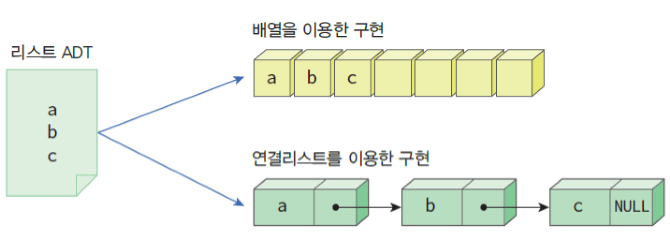

### **1. Array vs Linked List**

**Array** - 연속된 메모리 공간을 사용한 자료구조

- index를 통해 저장된 요소에 접근이 가능하며 속도는 O(1)
- 반면 연속되어 있기 때문에 끝 부분이 아닌 부분에 삭제, 삽입 연산을 할 경우 주변 요소들을 밀어내는 shift 연산이 필요하기 때문에 O(n)
- 정적인 자료구조로 선언 시 크기를 수정할 수 없으며 그 이상으로 데이터를 초과하여 저장할 수 없는 구조

**Linked List** - 연속되지 않은 메모리 공간을 사용

- Array와 다르게 동적인 자료구조, 크기가 자유로우며 노드로 구성되어 있다.
- 노드에는 데이터와 다음 노드를 가리키는 포인터가 저장되어 있어 메모리 공간 여기저기 퍼져 있어도 다음 노드를 알 수 있다.
- 인덱스가 없이 때문에 데이터 탐색 시에는 첫 노드부터 순차적으로 전부 탐색을 해야하므로 O(N)의 시간복잡도를 가진다.
- 삽입과 삭제의 경우 첫 노드에서 연산이 이루어지면 O(1) 그 이후 노드일 경우 탐색 과정이 필요하기 때문에 O(N) - 노드의 교체 자체는 O(1)의 시간복잡도를 가진다.
    - 노드 생성 - **b**
    - 삽입하고자 하는 위치의 바로 이전 노드(**a**)의 포인터를 새로 생성한 노드(**b**)로 변경
    - 새롭게 생성한 노드(**b**)의 다음 노드를 가리키는 포인터를 넣고자 하는 위치 바로 다음의 노드(**c**)를 가리키게 변경

**Doubly Linked List**

- 기존의 Linked List에서 바로 이전 노드를 가리키는 포인터가 추가된 것
- 단일 연결리스트에 비해 접근이 빠르다는 장점이 있으나 구현과 복잡하며 데이터의 개수가 많아 질수록 접근 연산이 복잡해지며 장점이 희미해지게 된다.