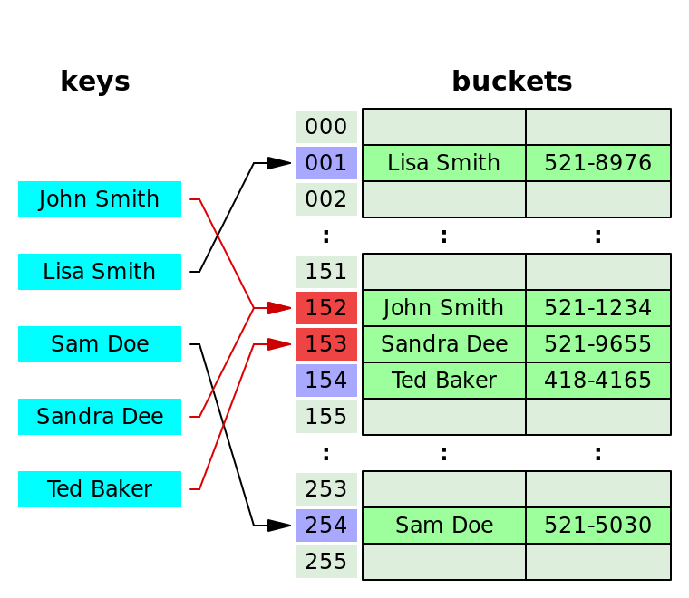

### **Hash Table**

Key와 Value 형태로 이루어진 데이터를 저장하는 자료 구조 중 하나

해시 테이블은 배열을 사용하여 데이터를 저장, Key 값에 해시 함수를 적용하여 고유한 숫자를 생성하여 인덱스로 활용한다.

원하는 데이터를 찾고자 할 때 Key 값을 입력하고 해시 함수 1번 수행으로 바로 인덱스를 찾을 수 있기 때문에 조회, 수정, 삭제가 빠르다. 평균적으로 O(1)의 시간복잡도

Key 값이 아무리 크더라도 다른 Key 값들과 동일한 길이의 해시 값으로 변경되기 때문에 일관성을 지키고 관리에 용이하다.

<aside>
💡 **해시 함수**
무언가를 잘게 쪼갠 후 결과물을 생성하는 것 - Hash (잘게 썰다)

- 입력값에 대해 항상 동일한 출력값을 가지며 모든 출력값의 길이가 같다는 특징
- 단방향성, 해시값에서 입력값으로의 역변환은 거의 불가능
- 다른 입력값에 대해 동일한 출력값이 나올 수 있다 - **해시 충돌**
  충돌이 많아질수록 함수의 시간복잡도가 증가하여 성능이 저하된다.
  ****좋은 해시 함수는 출동 확률이 낮다 = **충돌 저항성**이 높다

Ex) **SHA-256, Keccak-256, RIPEMD-160**

</aside>

**해시 충돌 해결법**

해시 함수를 통해 얻은 해시 값이 동일한 경우 발생하는 문제

이 문제로 인해 해시 함수의 시간복잡도는 항상 O(1)이 아니라 평균적으로 O(1)이다.

- Open Addressing
    - 해시 값이 동일할 경우 다른 주소에 데이터를 입력하도록 하는 방법
    - 방법은 크게 Linear Probing, Quadratic Probing
    - Linear Probing: 충돌이 발생했을 때 바로 다음 주소가 비어 있는지 확인하고 비어있으면 데이터를 입력, 아닐 경우 또 바로 다음 주소를 확인하는 방식
    - Quadratic Probing: Linear Probing의 문제점으로 충돌 횟수가 많아질 수록 데이터가 한 곳에 몰리는 클러스터링 발생이 있다.
      이를 해결하기 위해 나온 방식으로 바로 옆이 아닌 더 멀리 있는 비어있는 공간에 데이터를 넣자는 것이다.
      처음에는 바로 옆을 확인하지만 차있을 경우 제곱만큼 이동하여 자리를 찾는 방식이다.
        - 처음에는 $1^{2}$, 바로 옆을 확인
        - 이후 $2^{2}$
        - 또 차 있다면 $3^{2}$
    - 결과적으로 점점 본래 해시값이 있던 자리와 멀어지게하여 클러스터링을 방지하는 것

- Seperate Chaining
    - 자료 구조를 활용해 같은 주소의 데이터에 다음 데이터를 추가할 수 있게 해주는 것
    - 해시 테이블 자체의 확장 없이 추가 데이터를 저장할 수 있으며 구현이 간단하다
    - 하지만 chaining 되는 데이터가 많아지면 그만큼 캐시의 효율성이 감소
    - 연결에 사용하는 알고리즘은 연결 리스트 또는 트리를 사용

**Resize**

해시 테이블의 크기가 일정 크기 이상을 채울 경우 기존 크기의 2배 테이블을 선언하여 데이터를 옮기는 것

- 개방 주소법 - 실제 테이블, 버킷의 크기가 일정 수준 이상 채워졌을 때
- 분리 연결법 - 하나의 버킷에 들어가는 데이터가 일정 수준 이상으로 찼을 때

크기를 늘리면서 중복 해시는 다른 주소로 이동하게 할 수 있어 충돌로 인한 성능 문제를 어느 정도 해결 할 수있다.

자바의 경우 약 3/4 정도가 차게 되면 리사이징을 하게 된다.

**HashMap? HashTable?**

**해시 테이블**

- 동기화를 보장
- thread-safe - 멀티 쓰레드 환경에서 사용이 가능
  다른 쓰레드간에 동기화 락을 사용하기 때문에 데이터의 무결성 보장하지만 속도가 느리다
- Null 값을 허용하지 않는다.

**해시 맵**

- 동기화 보장 X
- thread-safe를 보장하지 않는다, 속도는 빠르지만 신뢰성과 안정성이 떨어진다.
  싱글 쓰레드 환경에서 사용이 적절
- Null 값을 허용