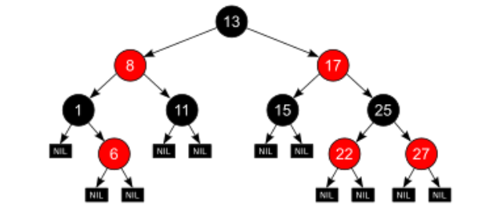
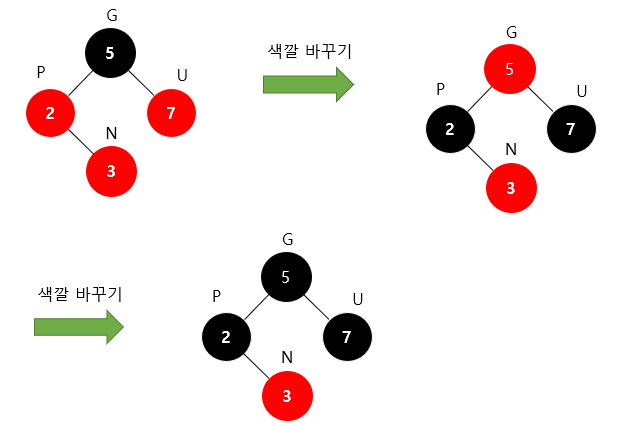

### **Red-Black Tree**

- **정의**
    - 일종의 자기 균형 이진 탐색 트리
    - 모든 노드가 빨강 또는 검정으로 표현되는 트리
    - 루트 노드는 항상 검은 색이며 리프 노드는 무조건 검은색 이어야 한다.
    - 노드의 색이 붉은 색이라면 해당 노드의 자식 노드는 모두 검은색이다.
      검은 노드의 자식은 아무 색이나 올 수 있다.
    - Black height: 루트 노드부터 리프 노드까지의 경로에 있는 검은 노드의 개수
      루트 노드에서 모든 리프 노드까지의 black height는 같다.
    - 삽입 삭제 시 모든 노드들의 균형이 맞도록 하기 때문에 worst case에서도 O(logN)의 시간 복잡도를 보장한다.

<aside>
💡 **이진 탐색 트리**

- 부모 노드의 왼쪽 자식 노드는 항상 부모 노드보다 작은 수
- 반대로 오른쪽 노드는 항상 부모보다 큰 수
- 중복된 키를 허용하지 않음
- 이러한 특성으로 인해 탐색 성능은 O(logN), 하지만 균형이 무너지면 O(N)으로 증가
</aside>

- **삽입** **- 삽입된 노드는 항상 붉은 색으로 지정**
    - **Restructuring- 노드를 삽입했을 때 부모 노드가 붉은 색이고 삼촌 노드가 검은색일 때 수행**
        1. 먼저 부모 노드, 조상 노드, 삽입한 노드끼리 오름차순으로 정렬하고 중간값을 부모 노드로 하여 트리를 재정렬
        2. 루트 노드를 검은 색으로 변경 후 나머지 자식 노드를 붉은 색으로 변경

           

           [https://code-lab1.tistory.com/62](https://code-lab1.tistory.com/62)

    - **Recoloring - 노드를 삽입했을 때 삼촌 노드가 붉은 색일 때 수행**
        1. 먼저 삽입된 노드를 제외한 부모, 삼촌, 조부모 노드의 색을 변경
        2. 다시 루트 노드를 검은색으로 변경하면 조건 만족

           
      [https://code-lab1.tistory.com/62](https://code-lab1.tistory.com/62)

      recoloring을 수행 후 다시 더블 레드 문제가 발생했을 때, 문제가 발생한 노드 기준으로 다시 recoloring 또는 resturturing을 해주면 문제를 해결할 수 있다.

      