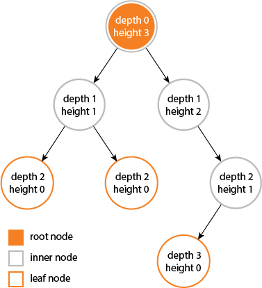

### **3. Tree**

**계층적 데이터로 나타내지는 노드들의 집합, 루트 노드를 제외한 모든 노드들은 단 하나의 부모를 가짐**

**구성, 용어 정리**

- 노드 - 트리의 기본 구성요소, 값과 하위 값에 대한 포인터
    - 루트 노드: 부모가 없는 최상위 노드
    - 부모 노드: 자식 노드를 가진 노드
    - 자식 노드: 부모 노드의 하위 노드, 루트를 제외한 노드는 모두 부모를 가짐
    - 형제 노드: 같은 부모를 가지고 있는 노드
    - 외부, 리프(leaf) 노드: 자식 노드가 없는 노드
    - 내부, 가지(branch) 노드: 하나 이상의 자식을 가지고 있는 노드
- 간선: 노드와 노드를 연결
- 깊이: 루트 노드로부터 특정 노드까지의 간선 개수
- 높이: 특정 노드로부터 리프 노드까지의 가장 긴 간선 개수, 최고 레벨
- 레벨: 트리의 각 층 별로 숫자를 메긴 것, 루트 0부터 시작

**특징**

- 하나의 루트 노드와 0개 이상의 하위 트리로 구성
- 데이터를 순서대로 저장하지 않고 순환하지 않는 계층형 구조
- N개의 노드를 가지는 트리는 항상 N-1개의 간선을 가짐

**종류**

- 편향 트리: 모든 노드가 자식을 하나만 가지는 트리
- 이진 트리: 모든 노드의 자식 노드가 2개 이하인 트리
    - 포화 이진 트리 - 모든 레벨이 꽉 차 있는 상태
    - 완전 이진 트리 - 왼쪽에서 오른쪽으로, 위에서 아래로 순서대로 채워진 이진 트리

**트리의 순회**

루트 노드의 방문 순서에 따라 달라지는 방식

- 전위 - 로트 노드 먼저, 왼쪽, 오른쪽 자식 순으로
- 중위 - 왼쪽 먼저, 루트 노드, 마지막으로 오른쪽 자식
- 후위 - 왼쪽, 오른쪽, 루트 노드 순으로 순회