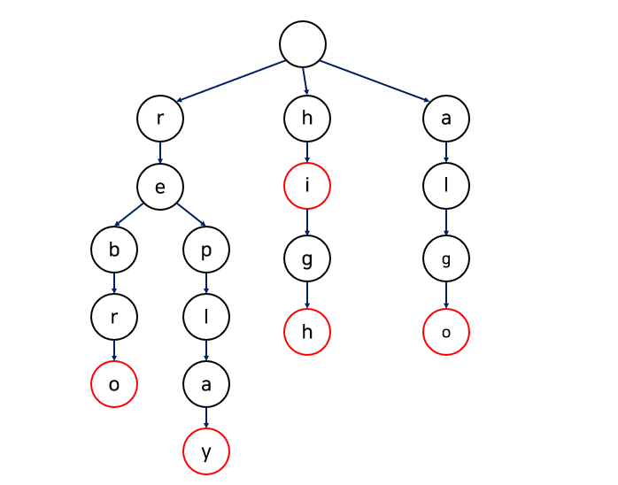

### **트라이**

---

**문자열의 집합을 트리 구조를 사용하여 문자 하나 당 자식 노드 하나에 저장하는 방식의 자료 구조**

이진 검색 트리의 검색은 O(logN)이지만 문자열을 비교할 경우 문자열의 길이(M) 만큼 시간이 더 걸리기 때문에 O(MlogN)이라는 시간이 걸리게 된다.

이것을 단축하기 위해 특화된 자료 구조가 **트라이**

- 자연어 처리 분양에서 문자열 탐색을 위한 자료 구조로 사용되고 있다.
- 검색 자동완성 알고리즘에 사용되는 자료 구조

[”rebro”, “replay”, “hi”, “high”, “algo”] 문자열 집합을 저장하면 아래와 같은 형태로 저장이된다.

붉은 노드는 문자열의 끝을 의미

- 이렇게 저장하게 되면 문자열을 전부 비교할 필요 없이 경로를 내려가면서 입력된 글자를 비교해나가면 된다.
- 자동완성의 경우 re를 입력할 경우 자동으로 rebro나 replay 중 하나를 추천

[https://velog.io/@klloo/자료구조-트라이Trie-자료구조](https://velog.io/@klloo/%EC%9E%90%EB%A3%8C%EA%B5%AC%EC%A1%B0-%ED%8A%B8%EB%9D%BC%EC%9D%B4Trie-%EC%9E%90%EB%A3%8C%EA%B5%AC%EC%A1%B0)

**장단점**

- 문자열을 빠르게 찾을 수 있다. 문자열을 노드를 따라가기만 하면 되기 때문에 O(N)의 시간복잡도를 가진다. 추가 또한 노드를 하나 더 추가하면 되기 때문에 간편하다.
- 필요한 메모리 크기가 매우 크다. 보는 바와 같이 하나의 노드에 하나의 알파벳을 넣기 때문에 매우 큰 공간복잡도를 요구한다.